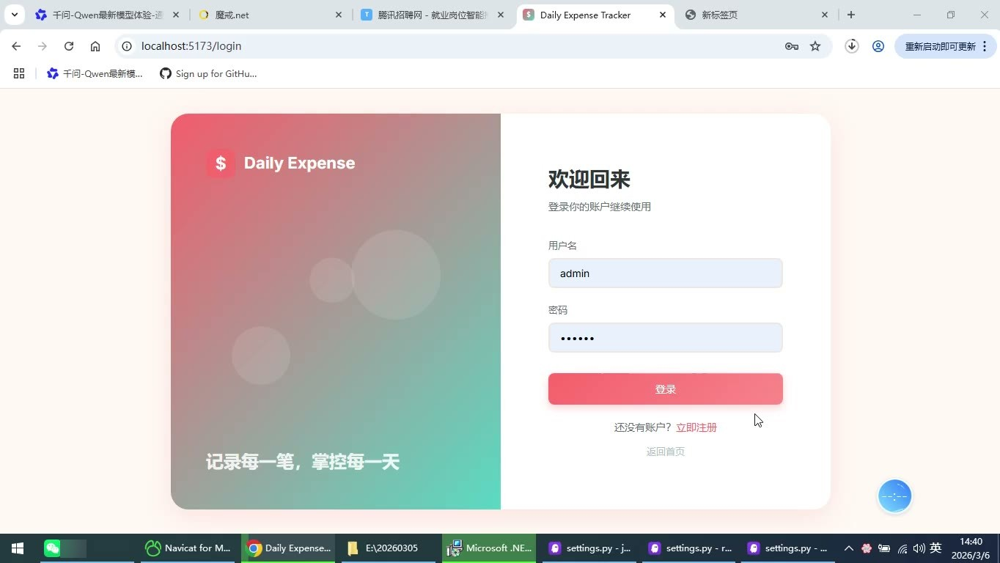
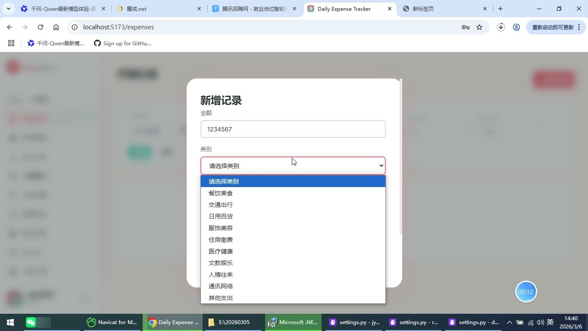
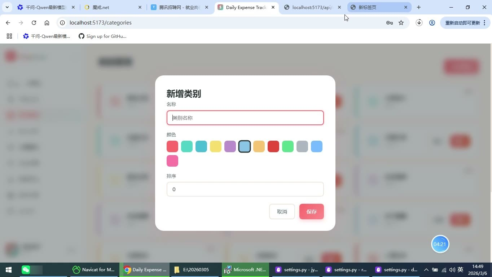
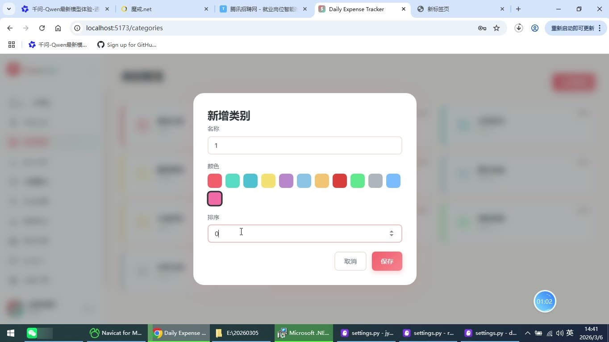
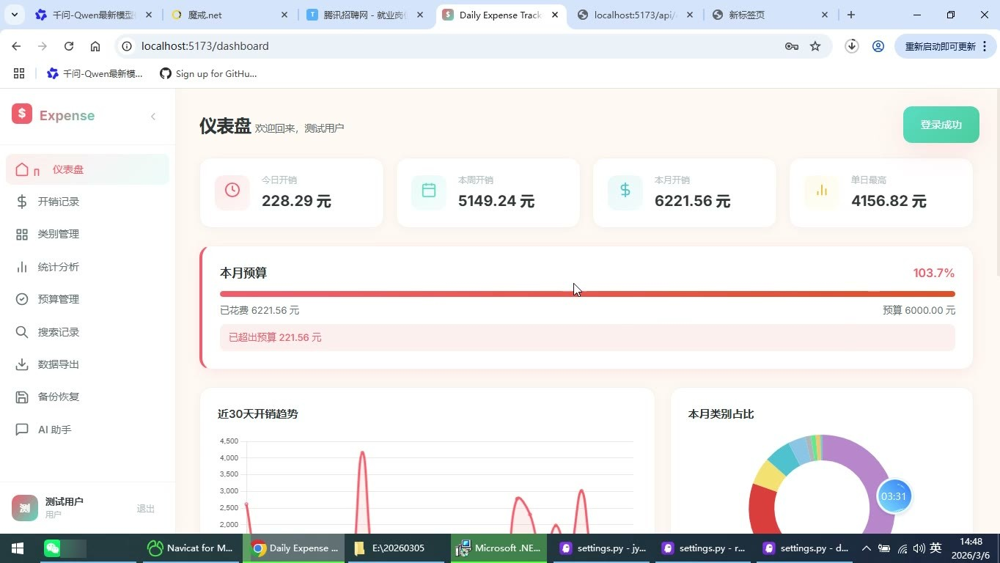
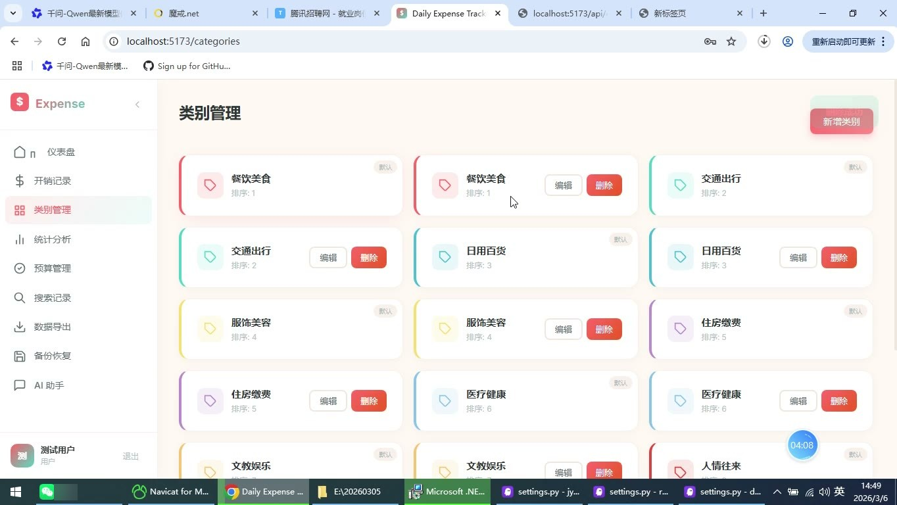

# (附文档)Python+Django+Vue3 日常开销记录

**技术栈**：Python、Django、Vue3、MySQL

### 系统简介

本系统是一套基于 Django + Vue3 前后端分离架构的日常开销记录平台，提供开销录入、类别管理、统计分析、预算控制、数据备份与导出、AI 财务助手等完整能力。系统区分普通用户端与管理员端两类角色，普通用户管理个人开销数据，管理员负责用户管理与平台数据统计。
 
### 核心功能
 
### 普通用户端

 
- 账号注册：填写用户名、密码、昵称完成注册，注册时自动复制系统默认类别到个人名下。 
- 登录与退出：通过用户名密码登录，密码经 SHA256 加密校验，登录后写入 session，可主动退出清空会话。 
- 个人资料维护：修改昵称与头像地址，保存后即时生效。 
- 开销录入：填写金额、类别、日期、支付方式（现金/微信/支付宝/银行卡/其他）、备注，并支持上传图片凭证。 
- 金额校验：创建与编辑时校验金额格式，禁止负数与非法字符。 
- 开销列表查询：分页展示个人开销记录，支持按类别、开始日期、结束日期、最小金额、最大金额、支付方式、备注关键字组合筛选。 
- 开销编辑与删除：修改已有记录任意字段，删除前弹出二次确认，删除后不可撤销。 
- 类别管理：新增自定义类别并设置名称、颜色、排序，编辑已有类别，删除后关联记录自动变为未分类。 
- 默认类别同步：可查看并使用系统内置默认类别，默认类别不可被普通用户删除。 
- 仪表盘概览：展示今日开销、本周开销、本月开销、单日最高开销四张统计卡片。 
- 预算进度提醒：仪表盘展示本月预算使用进度条、已花费金额、剩余金额，超支时高亮警告并显示超出金额。 
- 近30天趋势图：以折线图展示近 30 天每日开销走势。 
- 类别占比图：以环形图展示本月各开销类别金额占比，并附类别图例。 
- 最近记录速览：仪表盘直接展示最近 8 条开销明细，可一键跳转查看全部。 
- 统计分析页：查看今日、本周、本月累计开销，本月分类汇总，近 30 天每日明细，以及单日最高与单日最低开销。 
- 预算设置：按年月设置月度预算金额，同一月份重复设置自动覆盖更新。 
- 预算列表：展示各月预算金额、已花费、剩余或超支金额、使用百分比，超 80% 预警、超 100% 标红。 
- 预算删除：删除指定月份的预算记录。 
- 数据导出：按开始日期、结束日期、类别筛选后导出为 Excel 或 CSV 文件。 
- 数据备份：一键创建备份，列表展示备份文件名、创建时间与文件大小。 
- 备份下载：将指定备份文件下载到本地保存。 
- 备份恢复：从指定备份还原数据，恢复前弹出确认提示，恢复将覆盖当前数据。 
- AI 财务助手：基于 DeepSeek 大模型进行多轮对话，结合个人开销数据提供消费分析与理财建议，内置常用提问快捷入口。 
- 首页展示：无需登录即可访问首页，查看平台介绍、核心功能说明与轮播图。
 
### 管理员端

 
- 用户列表管理：查看平台全部注册用户信息，包括用户名、昵称、角色、注册时间。 
- 用户删除：删除指定用户账号及其关联数据。 
- 平台数据统计：查看平台整体统计数据，掌握全局开销概况。 
- 轮播图管理：新增轮播图并设置标题、图片地址、跳转链接、排序与启用状态。 
- 轮播图列表：查看全部轮播图配置及启用情况。 
- 轮播图删除：移除不需要的轮播图配置。 
- 后台入口：通过 Django Admin 后台进行数据维护。
 
### 技术栈

 后端语言Python 后端框架Django + Django REST Framework ORMDjango ORM（聚合 Sum/Count、TruncDate 按日分组） 认证与权限Session 会话认证 + SHA256 密码加密 + 角色路由守卫 前端框架Vue3（Composition API + script setup） 前端路由Vue Router（history 模式，含登录与管理员权限拦截） 图表库Chart.js（折线图、环形图） 数据库MySQL 数据导出CSV / Excel 文件流导出 AI 能力DeepSeek 大模型对话接口
 
### 交付内容

 
- 后端完整源码 
- 前端完整源码 
- 数据库初始化脚本 
- 万字文档

## 界面展示

---

## 获取完整源码 + 万字文档

本仓库为项目介绍页。**完整前后端源码、数据库初始化脚本、万字项目文档**，请加微信 `kangkangcode`，或访问 [codekk.top](http://codekk.top) 获取。

可作课程设计 / 毕业设计参考，支持远程部署调试。